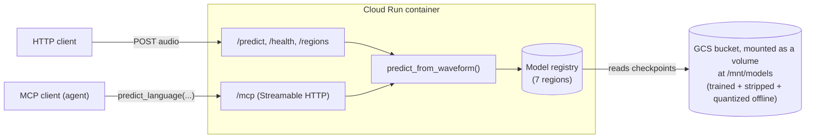

# Spoken Language Identification Service

A spoken language ID system I built and deployed: 7 fine-tuned wav2vec2 models (one per world region, trained on FLEURS), served through FastAPI and MCP, containerized, and deployed to GCP Cloud Run with GitHub Actions handling CI/CD.

**How it works:** you send in an audio clip, the service runs it through the right region's model(s), and you get back a predicted language with a confidence score. It's callable as a normal REST API or as an MCP tool, so an agent can use language ID as a capability instead of a person hitting the endpoint by hand.

## Why 7 models instead of 1

The models are trained on FLEURS, grouped into 7 regions (`western_europe`, `eastern_europe`, `central_asia_middle_east_north_africa`, `sub_saharan_africa`, `south_asia`, `south_east_asia`, `cjk`) rather than one model classifying across all ~100 FLEURS languages at once. Smaller per-model label spaces made training more managable, at the cost of needing a registry pattern instead of just loading a single model.

## Architecture



## Tech stack

| Layer | Choice |
|---|---|
| Model | Custom `Wav2Vec2ForSpeechClassification` (HuggingFace `Wav2Vec2Model` + mean-pooled classification head), fine-tuned per region on `google/fleurs` |
| Serving | FastAPI, Uvicorn |
| Agent interface | MCP (Model Context Protocol), Streamable HTTP transport, mounted on the same FastAPI app |
| Model compression | Int8 dynamic quantization (onednn engine), optimizer-state stripping — ~3.7GB training checkpoints down to 355MB checkpoints |
| Containerization | Docker (`python:3.12-slim`) |
| Cloud infra | GCP Cloud Run (scale-to-zero), Artifact Registry, GCS (model storage, mounted as a runtime volume) |
| CI/CD | GitHub Actions — build → push → deploy → automated post-deploy MCP test, keyless auth via Workload Identity Federation |

## API

The service is deployed and live on Cloud Run, but I'm not posting the service URL here. Happy to share the actual URL on request, just ask.

**REST**:
```bash
curl -X POST https://<service-url>/predict -F "file=@sample.wav"
curl -X POST "https://<service-url>/predict?region=east_asia" -F "file=@sample.wav"
curl https://<service-url>/regions
```

**MCP**: `predict_language(audio_base64, top_k, region=None)` and `list_supported_regions()`, callable by any MCP client against `https://<service-url>/mcp`.

## CI/CD

Every push to `main` triggers `.github/workflows/deploy.yml`: build, push to Artifact Registry, deploy to Cloud Run using Workload Identity Federation so there's no stored key, then run an MCP client against the live deployed URL and fail the pipeline if it errors.

## Repository layout

- `predict.py`: FastAPI app: model registry, `/predict`, `/mcp`, `/health`, `/regions`
- `model_arch.py`: the custom model architecture
- `fleurs_config.py`: FLEURS language to region label mappings
- `train.py`: training loop (per-region fine-tuning on FLEURS)
- `strip_checkpoint.py`: strips optimizer state and optionally quantizes a training checkpoint
- `Dockerfile`: creates base model config at build time, models come in through a GCS mount at runtime
- `.github/workflows/deploy.yml`: CI/CD pipeline
- `tests/test_mcp_client.py`: MCP client for manual + CI testing
- `tests/sample.wav`: sample audio file for manual + CI testing

## Performance notes

Getting cold start down took a few trial rounds, so here's the full sequence with the numbers that drove each decision.

**Baseline: sequential loading, models baked into the image**
Each region's checkpoint loaded one at a time inside `load_all_models()`. Slow, but stable, since only one region's load was ever in memory at a time.

**Moved to GCS-mounted models, to decouple code deploys from model weight size**
Models went from being `COPY`'d into the Docker image to sitting in a GCS bucket mounted as a Cloud Run volume at `/mnt/models`, read via `MODEL_ROOT` at runtime. This sped up CI, since there's no multi-GB image push on every commit, but made cold start slower as GCS FUSE reads are higher-latency than local disk. First real cold-start measurement: ~5 minutes.

**Parallelized loading with `max_workers=len(REGIONS)` (7)**
Result: container OOM-killed. Root cause: each region's `load_model()` call briefly holds both a full fp32 model (from the random weight init) and its quantized copy in memory before the fp32 version gets discarded. Loading all 7 in parallel meant all 7 hit that peak simultaneously, a ~7x spike in transient memory.

**Capped concurrency at `max_workers=4`**
CPU utilization during load peaked at ~26% (the container has 4 vCPUs), which confirmed that the load is I/O-bound (waiting on GCS reads), not CPU-bound, so concurrency should help. Resulting cold-start: ~2.5 minutes, no OOM. Also logged that memory utilization was 88% of 16GB, which was too much for the compressed models.

**Found and fixed the memory bloat: `meta` device for model construction**
Constructing the model with `with torch.device("meta")` skips allocating or filling real tensors, and `model.to_empty(device="cpu")` materializes real storage right before quantization and the real trained weights load in and overwrite it. Result: memory utilization dropped to 63% at the same `max_workers=4`, and cold start dropped to ~2 minutes.

**Final configuration: `max_workers=6`**
With the memory fix in place, I re-tested with more workers. `max_workers=6` is the highest setting without running into OOM, bringing cold start to ~1.5 minutes, down from the ~5 minute starting point.
